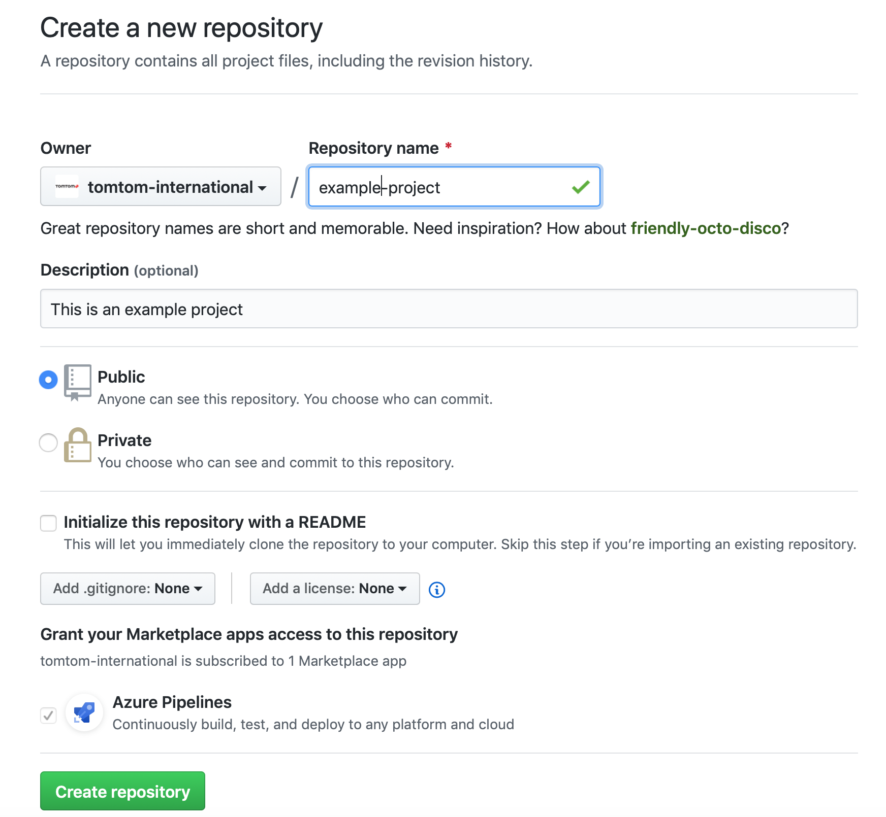
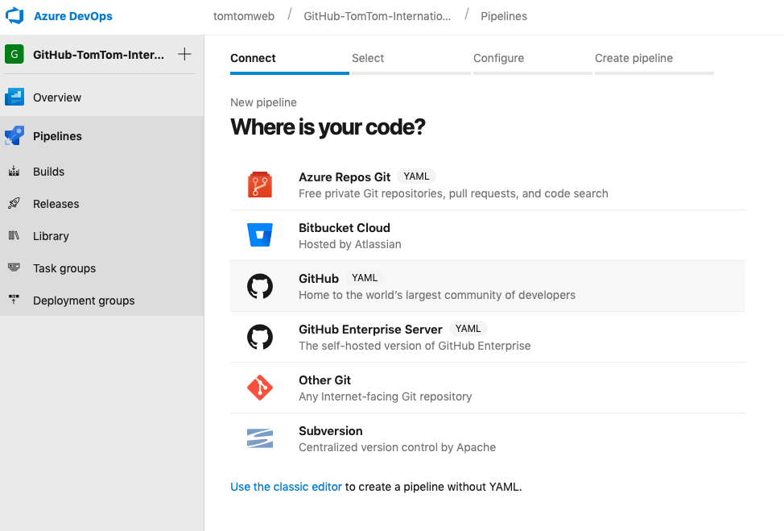
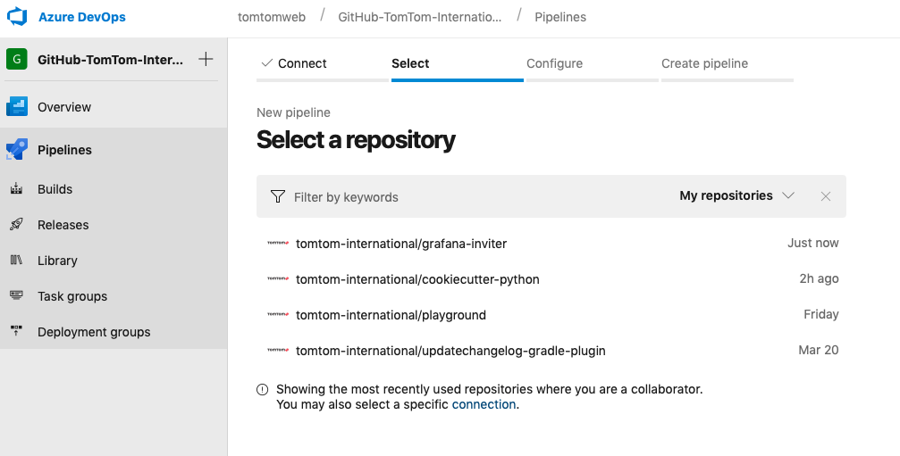
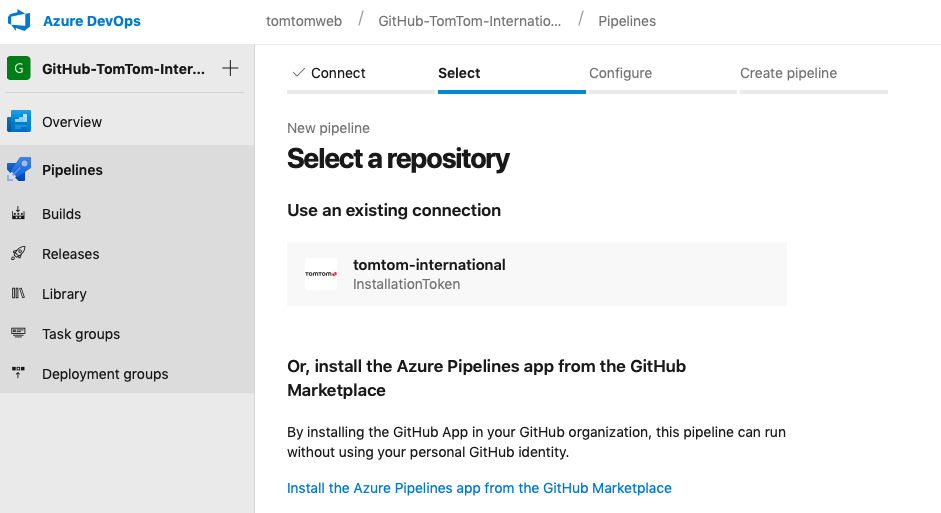
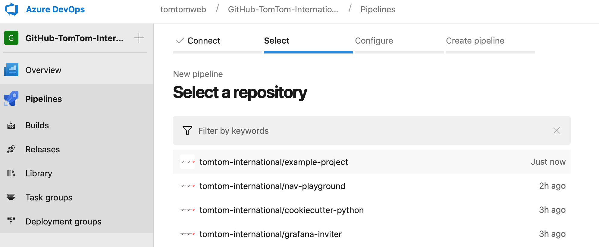
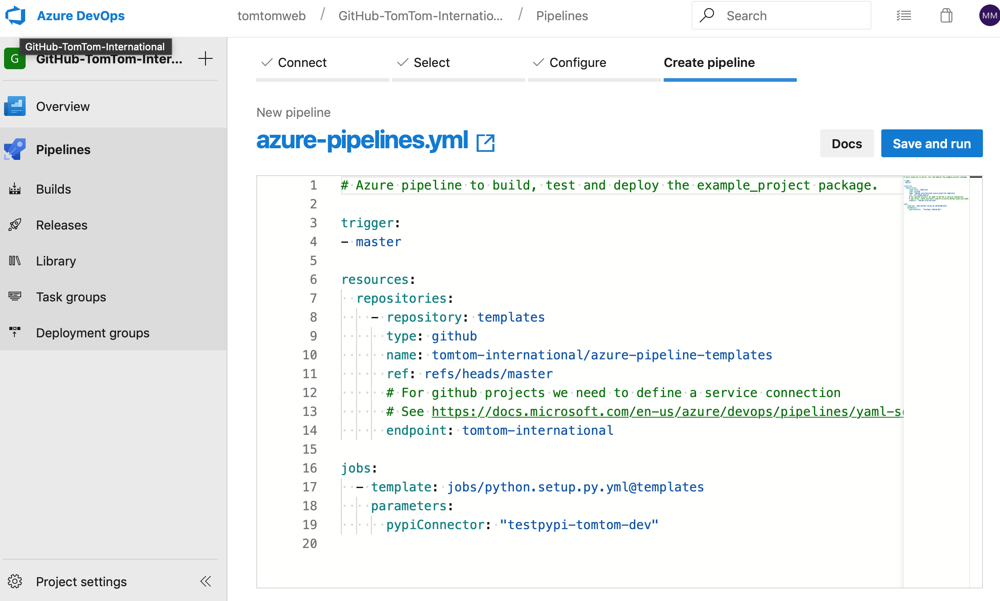

# Azure Pipeline Templates

This repository is the counterpart to the [Jenkins Shared Library repository](https://github.com/tomtom-international/jsl/) and contains various templates that can be used by [Azure Pipelines](https://azure.microsoft.com/en-gb/services/devops/pipelines/).

## Templates

### Jobs

#### python.setup.py.yml

This job is based on setuptools and runs builds, linter and tests using `python setup.py` commands.

### Steps

#### python.build.yml

#### python.publish.yml

## Creating Azure Pipelines

This step-by-step guide shows how to make use of Azure Pipelines and these templates in your own project. It shows you how to create a Python project and use the Python template job from this repository.

The following steps will create a Python project generated with the [`tomtom-international/cookiecutter-python`](https://github.com/tomtom-international/cookiecutter-python) template.

1. Create a project using [cookiecutter](https://github.com/audreyr/cookiecutter)

    The cookiecutter will ask you at some point for a project name (`project_name`). For this tutorial we will use the name `example-project`.

    ```bash
    cookiecutter gh:tomtom-international/cookiecutter-python
    ```

2. Create a new repository on GitHub


1. Push the generated project to GitHub

    ```bash
    # Enter the previously generated project
    cd example-project

    # Initialize project for Git
    git init

    # Configure the remote to the newly create Github project
    git remote add origin https://github.com/tomtom-international/example-project.git

    git add -A
    git commit -am "Initial commit"
    git push -u origin master
    ```

1. Go to your Azure DevOps account (eg. https://dev.azure.com/your_organization/your_project/_build)

1. Create a new build pipeline for the newly created repository


1. Select Github:


1. Scroll down to the bottom of the list and click on the **connection** link (Search for '*You may also select a connection*'):


1. Select the service connection for your GitHub account/organization (A detailed description on how to create service connections can be found in the official [Azure Devops documentation](https://docs.microsoft.com/en-us/azure/devops/pipelines/repos/github?view=azure-devops))


1. Select the newly created repository:


1. Click on **Run** or **Save and run..** to trigger the first build and wait until the build finishes to see the results:

