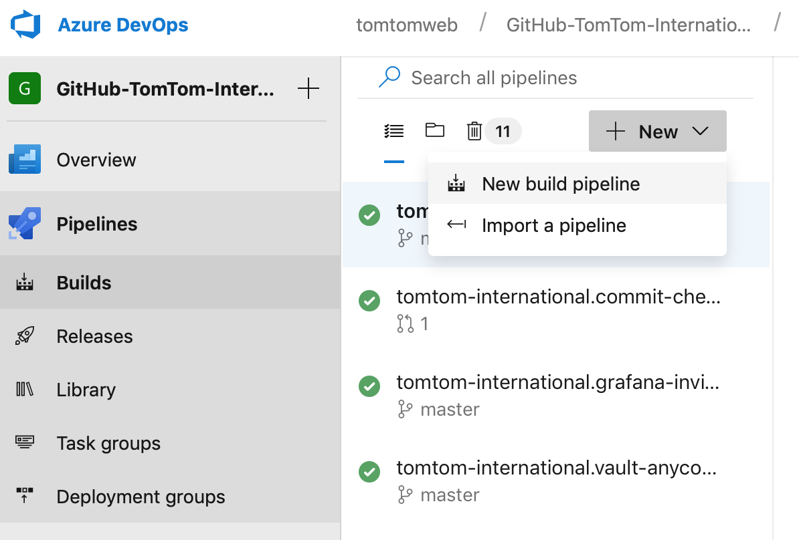

# Azure Pipeline Templates

This repository is the counterpart to the [Jenkins Shared Library repository](https://github.com/tomtom-international/jsl/) and contains various templates that can be used by [Azure Pipelines](https://azure.microsoft.com/en-gb/services/devops/pipelines/).

## Templates

### Jobs

#### python.setup.py.yml

This job is based on setuptools and does the following:

* builds the Python module
* validates the module (eg. linter, tests)
* deploys the module to a PyPI index
* deploys the module as a Docker image to a Docker registry

Before using the pipeline please create a new [variable group](https://docs.microsoft.com/en-us/azure/devops/pipelines/library/variable-groups?view=azure-devops&tabs=yaml)
with the name `GitHub`. This group contains variables required during the release/deploy
process.

Add the following variables to the group:

* GH_TOKEN

  The [personal access token](https://github.com/settings/tokens) is used when pushing the version bump commits to the master branch during a release (see details below in *Variables -> release*). Change the variable type to *secret*.
* GH_USER_MAIL

  The email of the user assigned to the personal access token (*GH_TOKEN*).

  Example: `123847392+my-ci-user@users.noreply.github.com`
* GH_USER_NAME

  The name of the user assigned to the personal access token.

  Example: `my-ci-user`

##### Variables

###### release

The Python pipeline allows only on-demand releases. By default the project is only built and validated. If a new release of the Python module and Docker image
should be released a new build has to be queued.

In order to initiate a new release the variable *release: true* needs to be defined during the queuing. This will result in bumping the
version (snapshot->release) and result in a deployed PyPI package, a Docker image and two version commits.

In order

###### dockerSnapshot

By default Docker images are built only during the release process. In case a snapshot image is needed one can queue a new build and set the variable
*dockerSnapshot: true*. This will result in building a Docker image with a snapshot version.

##### Parameters

###### dockerDeploy

Flag to enable/disable building and publishing a Docker image with the Python module.

*Default*: true

###### dockerDeployFile

Filename of the Dockerfile used for defining the content of the image to be pushed to the Docker registry.

*Default*: Dockerfile

###### dockerRegistryConnector

Azure DevOps service connector that defines the Docker registry where the Docker image should be pushed to.

*Default*: tomtom-docker-registry-bintray

###### dockerRepo

Name of the repository an image should be pushed to. This is as well called in Docker terminology a namespace.

A Docker image with a Python module will be called `<dockerRepo>/<name-of-module>`.

*Default*: python

###### pypiConnector

Azure DevOps service connector that defines the PyPI index (eg. pypi.org) where PyPi modules should be deployed to.

*Default*: testpypi-tomtom-dev

###### pythonUserVersion

The Python version used for creating the source distribution package deployed to the specified PyPI index.

*Default*: 3.6

## Creating Azure Pipelines

This step-by-step guide shows how to make use of Azure Pipelines and these templates in your own project. It shows you how to create a Python project and use the Python template job from this repository.

The following steps will create a Python project generated with the [`tomtom-international/cookiecutter-python`](https://github.com/tomtom-international/cookiecutter-python) template.

1. Create a project using [cookiecutter](https://github.com/audreyr/cookiecutter)

    The cookiecutter will ask you at some point for a project name (`project_name`). For this tutorial we will use the name `example-project`.

    ```bash
    cookiecutter gh:tomtom-international/cookiecutter-python
    ```

1. Create a new repository on GitHub


1. Push the generated project to GitHub

    ```bash
    # Enter the previously generated project
    cd example-project

    # Initialize project for Git
    git init

    # Configure the remote to the newly create Github project
    git remote add origin https://github.com/tomtom-international/example-project.git

    git add -A
    git commit -am "Initial commit"
    git push -u origin master
    ```

1. Go to your Azure DevOps account (eg. https://dev.azure.com/your_organization/your_project/_build)

1. Create a new build pipeline for the newly created repository


1. Select Github:


1. Scroll down to the bottom of the list and click on the **connection** link (Search for '*You may also select a connection*'):


1. Select the service connection for your GitHub account/organization (A detailed description on how to create service connections can be found in the official [Azure Devops documentation](https://docs.microsoft.com/en-us/azure/devops/pipelines/repos/github?view=azure-devops))


1. Select the newly created repository:


1. Click on **Run** or **Save and run..** to trigger the first build and wait until the build finishes to see the results:

